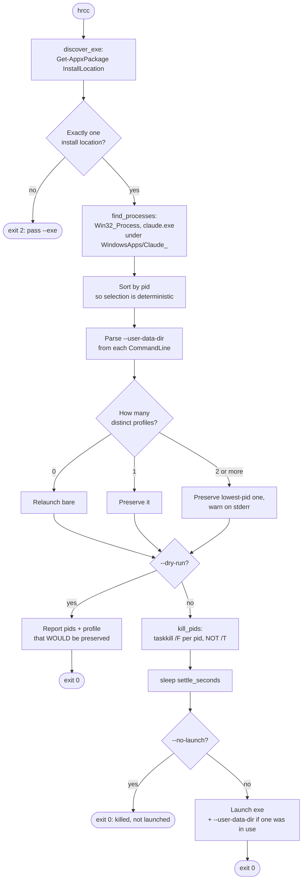
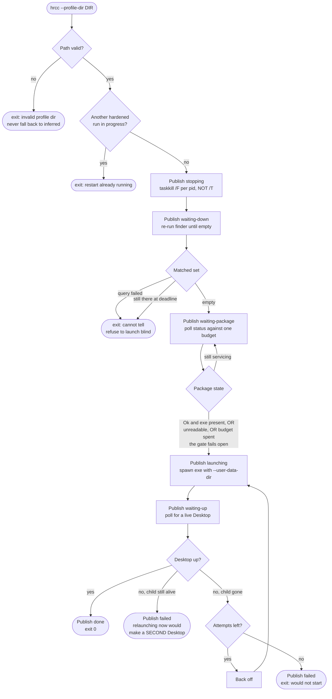

# DESIGN — hard-restart-claude-code

The *how*. `BRIEF.md` holds the *why* and the charter; `SESSION.md` is the
running log.

## Preserving the account profile on relaunch

### The problem

`hrcc` v1 always relaunched Claude Desktop bare:

```python
subprocess.Popen([str(exe)], ...)
```

The sibling project `account-swap` selects which account Desktop runs as by
passing `--user-data-dir <profile>`. So a bare relaunch silently moved the user
back to the default account, losing the account they were actually working in.

v1 mitigated this socially — a `SESSION.md` note saying "use `account-swap swap`
rather than bare `hrcc`". That held only because `hrcc` was a deliberate
config-reload tool, run by someone thinking about their Claude setup. It is a
weak mitigation: the check depends on the user remembering, at exactly the moment
their attention is on hooks or settings rather than on accounts.

Measured on a live system while writing this: 12 Desktop processes running, all
of them under `--user-data-dir=<secrets>\account-swap\userdata\reserve`. A bare
`hrcc` at that moment would have moved the session to the default account with
no message of any kind.

### The design

`hrcc` reads the `CommandLine` of the Desktop processes it is about to kill,
extracts `--user-data-dir` if present, and reproduces it on relaunch.

This is **not** a dependency on `account-swap`. `hrcc` observes its own target
process's argv and restores it, which is squarely within "restart what was
running". Any future flag worth preserving extends the same seam.

Consequences for structure:

- Process discovery moves from `Get-Process` to
  `Get-CimInstance Win32_Process`, because the command line is needed and
  `Get-Process` does not carry it. This also removes a latent hazard:
  `Get-Process`'s `.Path` requires `OpenProcess` rights and yields `$null` for
  processes outside the caller's reach, which would silently drop them from the
  match.
- PowerShell now returns JSON (`ConvertTo-Json`) rather than bare lines. A
  command line can contain spaces, quotes and delimiters, so line-splitting is
  not safe. Decoding tolerates a single object as well as an array, since
  PowerShell emits an object rather than a one-element array in some paths.
- `find_pids` becomes `find_processes`, returning `ClaudeProcess` records
  (`pid`, `path`, `profile_dir`). The profile therefore arrives through the
  existing injected `finder` seam, so `hard_restart` gains no new parameter — it
  is already at the Rule of 7 limit. The four injected collaborators are
  therefore grouped into one `Effects` object, and each later capability the
  restart learns costs one field there rather than one more parameter.
- `Result` gains `profile_dir` so the CLI can report what it preserved.

### The matcher stays narrow, deliberately

The install-path filter is load-bearing safety, not incidental.
`account-swap` keeps a Claude Code CLI at

```
<secrets-dir>\account-swap\userdata\<profile>\claude-code\<version>\claude.exe
```

whose basename is also `claude.exe`. Widening the matcher to a `*Claude*`
substring would kill the user's own running CLI. Regression tests assert the
matcher never widens to `*Claude*` - testing an absence, because that absence
is the safety property.

The match is a **prefix** test against `%ProgramFiles%\WindowsApps\Claude_`,
evaluated in Python on the rows PowerShell returns. It was previously a
`-like '*WindowsApps\Claude_*'` substring test inside the query, which also
matched a path the user can create themselves, such as
`%USERPROFILE%\WindowsApps\Claude_x\app\claude.exe`. That mattered because a
matched process is not merely killed: its `--user-data-dir` is parsed back out
and handed to the relaunch, and a Claude data dir holds
`claude_desktop_config.json`, which defines MCP servers as command lines. So the
weaker test let any process running as the user choose the data dir the real
Desktop would restart against. `%ProgramFiles%\WindowsApps` is admin-only, which
is the property the prefix test relies on.

### Lifecycle



## Why `taskkill` must NOT use `/T`

Tree-kill looks like the right verb for a tool whose purpose is leaving nothing
behind, and it was tried. It is wrong here, and the reason is worth recording so
nobody re-adds it.

`hrcc` is normally run from a shell **inside** Claude Desktop — the
`restart-claude` skill invokes it through Desktop's own Bash tool. So the `hrcc`
process is a descendant of a `claude.exe` that is in the pid list it is about to
kill. Measured ancestry during development:

```
powershell.exe -> bash.exe -> bash.exe -> bash.exe -> claude.exe -> claude.exe (25988)
```

and pid 25988 was in that run's matched set. `taskkill /F /T /PID 25988` walks
the subtree and kills the shell and `hrcc` with it — so Desktop dies, nothing
relaunches, and the profile this design exists to preserve is never applied.
The failure is invisible to `--dry-run`, which returns before any kill happens.

Individual `/F /PID` kills are correct: the `Win32_Process` query already
enumerates every Desktop process directly, so there is no orphan left for `/T`
to catch that is not already in the list.

## Why `discover_exe` refuses two packages

`Get-AppxPackage -Name 'Claude'` can return two rows while an MSIX update is
being deployed — the staged new package and the installed old one. v1 took the
first non-empty line, which is a coin flip during exactly that window, and the
consequence is relaunching the wrong version.

Distinct install locations are now collected, and anything other than exactly one
returns `None`, so the CLI fails with its existing clear message instead of
guessing. Duplicate identical rows are tolerated, since they are not ambiguous.

## Hardening the relaunch (opt-in)

`hard_restart` relaunches and returns. It does not check that Desktop came back,
and it cannot see that an MSIX update has left the package `Disabled` for the
second or two Windows needs to service it. A relaunch that loses that race
leaves Desktop down with nobody retrying and nobody reporting.

`account-swap` already solved this, in the wrong place. It calls
`hrcc --no-launch` to stop Desktop, throws away hrcc's launch, and reimplements
it with a readiness gate, bounded retry and liveness verification. That split
puts a process boundary in the middle of one restart, and the two halves talk
across it by **scraping hrcc's human-readable stdout** - the caller matches the
`matched pids:` line with a regex and carries an explicit hedge for "its output
shape has changed". A cosmetic reword of one `print` in `cli.py` breaks a
caller's liveness probe. That seam, not tidiness, is the reason the hardening
belongs here.

### What turns it on

**Nothing, by default.** A bare `hrcc` keeps today's behaviour exactly: kill,
settle, relaunch, return in about a second, no window, no polling. That matters
because `hrcc` is normally typed by a human from a shell inside Desktop, and a
command that can now block for minutes is a different tool than the one they
learned.

The hardened path is opt-in and implied by `--profile-dir`:

| Flag | Effect |
| --- | --- |
| `--profile-dir <dir>` | Launch against this data dir; implies `--verify`. |
| `--no-profile` | Launch bare. Distinct from omitting `--profile-dir`. |
| `--verify` | Down-confirmation, readiness gate, verified launch, retry. |
| `--progress-file <path>` | Publish phase transitions here. Defaults to hrcc's own dir. |
| `--label <text>` | Opaque display string echoed into the progress file. |
| `--json` | Machine-readable result on stdout. |

Omitting `--profile-dir` is **not** the same as `--no-profile`. Omitting it
preserves whatever profile was already running, which is right for a human
restarting in place and catastrophic for a caller whose entire purpose is
switching to a different one: a dropped flag would silently relaunch the previous
account and look like it worked. Callers pass the flag explicitly, always.

`--label` is how the progress file gets a human-meaningful name without hrcc
learning what an account is. hrcc knows a directory. If a future change wants to
call this `--account`, the boundary has leaked.

### Confirming Desktop is down

`settle_seconds` is **replaced**, not kept alongside the new wait. `taskkill /F`
returning is not termination, and the pid list is a snapshot taken before the
kill, so a process that appears during it is invisible. The hardened path
re-runs the finder against a deadline until the matched set is empty.

The confirmation runs even when the initial snapshot was empty. The stated
hazard is a process the snapshot could not see, and that cuts both ways: a
Desktop still starting up when we looked is invisible to it too, and
launching over that produces the same two Desktops. Confirming an empty
snapshot costs one poll that returns immediately.

Refusing after the kill leaves Desktop down, which is a different situation
for a caller than refusing before it. The refusal therefore carries the pids
it already killed, and the CLI reports them, so "nothing happened, safe to
retry" stays distinguishable from "Desktop is down and did not come back".

The reader must distinguish "no Desktop processes" from "the query failed", and
**refuse to launch on the second**. Relaunching while blind is how two Desktops
happen. `_decode_rows` currently collapses both to an empty list, and a test
asserts that collapse, so the reader and that test both change as part of this.

### The package-readiness gate

Before each launch attempt, poll the package status until a package reports `Ok`
with its executable present, and launch that one. The budget is a single
deadline computed once at entry and threaded down - recomputed per attempt it
would multiply by the attempt count.

Mid-update the staged and installed packages are both listed. The gate takes the **first serviceable** one, unlike `discover_exe`, which refuses all ambiguity - an `Ok` package is precisely what the gate is waiting for, and refusing it would strand the restart this exists to rescue.

The gate **fails open**. If the package query cannot run at all, stop waiting
immediately and let the launch be judged on its own result; if the budget
expires, launch anyway. A gate that cannot verify must never be the reason a
working restart does not happen. This is easy to invert while porting, so it is
stated here rather than left in a comment.

A forced-status seam (`--simulate-package-status Disabled`) exercises the whole
path on demand. Without it the only trigger is a real MSIX update landing inside
the restart window, which is why this code has never once run in production
despite being written to handle it. Seams make the *reaction* testable; the
*premise* - that Windows really reports `Disabled`, and that launching into it
really fails - stays integration-only, and the simulate flag is how it gets
exercised deliberately instead of by ambush.

### Verified launch and the no-retry rule

After spawning, poll for a live Desktop. On failure, back off and try again,
bounded. One rule carries over verbatim, because getting it wrong produces the
worst outcome in this design:

> If the spawned child is **still alive** but Desktop is not up, do **not**
> relaunch. Publish failure and stop.

A still-running child means Desktop is coming up slowly, not failing. Launching
again produces two Desktops on two data dirs. The corollary is that the launcher
seam must report the child's fate, so it returns a handle rather than nothing.
"Exited" is not immediately "failed" either: an MSIX launcher hands off and exits
within a second on a perfectly good launch, so a grace period after exit is part
of the rule, not a tuning constant.

The grace decides whether a retry is *permitted*; it does **not** end the wait.
Ending it there would make the grace the real deadline, because on MSIX the child
always exits - and a Desktop merely slower than the grace would then get a second
one spawned on top of it, which is the outcome this whole section exists to
prevent. The wait runs to its own timeout either way, and a launch that is truly
dead costs that timeout per attempt. That is the trade: latency on an already
failed launch, in exchange for never retrying over a live one.

### Progress, and who owns the state file

hrcc becomes a **writer**. It does not own the reader, and it does not spawn a
UI.

The widget is PowerShell that lives in `account-swap`, deliberately shaped to
stack with that project's usage widget - same mutex idiom, same position file,
same chrome. Moving it here would orphan it from the only thing it coordinates
with, and hand a zero-dependency CLI a WPF subsystem with no second consumer.

hrcc therefore takes `--progress-file <path>` and defaults it to its **own**
directory. Hardcoding a consumer's path would put that consumer's name in this
tool's source, which is the same dependency inversion the profile design already
refuses. `account-swap` passes its existing path, so its widget and its directory
are untouched.

The file is single-slot and rewritten on every publish. Its contract:

- `schemaVersion`, so a reader upgraded on a different cadence can tell.
  **Strict writer, lenient reader**: the writer rejects an unknown phase, the
  reader ignores unknown fields and falls back to the free-text detail on an
  unknown phase rather than mis-rendering.
- Timestamps are RFC 3339 with an explicit offset or `Z`. A naive UTC string is
  read as **local** time by the PowerShell reader, which puts every frame past
  its staleness cutoff and shows a "waiting to start" screen for the entire
  restart. Unit-test the exact string.
- UTF-8, no BOM. Integers stay integers.
- Write-temp-then-rename, **with the fallback to a plain overwrite when rename
  fails**. MSIX virtualization of the local app-data path produced exactly that
  failure and silently disabled the whole status channel; catch broadly rather
  than testing for a specific errno, because under the filter driver it is not
  reliable.
- A publish failure never breaks the restart. That includes the phase-name
  validation.
- Published strings stay path-free. The natural exception messages here embed a
  profile path, and a profile path points into a private directory; keep the full
  text in the local log and publish a short reason.

Because the file is overwritten, it is evidence of the *current* phase and never
of the run. A 7.6-second success records a null package status and is
indistinguishable from a run where the gate never fired - precisely the confusion
that made this gate hard to reason about. A per-run append-only trace beside it
fixes that, and the writer is being rewritten anyway.

### Surviving the kill

hrcc is a descendant of a `claude.exe` in its own kill list. It survives only
because kills are individual `/F /PID` and never `/T` - see "Why `taskkill` must
NOT use `/T`" below, which measured the ancestry. Nothing about the hardened path
changes this, and it does **not** need to self-detach: a caller in exactly this
position ran a full stop-and-relaunch and published its terminal phase
afterwards, so the orphaned-but-alive case is observed, not assumed.

What does change is duration. The orphan's parent is gone, so **stdout is a dead
pipe**, and a run that now lasts minutes writes to it many times where a
one-second run barely did. Writes to the result channel must tolerate a broken
pipe. Exit status still works, because the caller that reads it is a sibling
survivor, not the killed parent.

Two hardened runs must not overlap. Now that this path is reachable from a
user-facing CLI as well as from a caller, take a named mutex for the duration and
have the second invocation refuse with a clear message. `--dry-run` never takes
it.

### Precedence, exit codes, and machine-readable output

An explicit `--profile-dir` **always wins** over inference, and a value that
fails validation is a non-zero exit, never a silent fall back to the inferred
dir. Falling back would launch Desktop on the profile that *was* running while
the caller records the one it asked for - a cross-account session confusion with
live credentials in both directories. Multiple running profiles are still
detected and still reported, but with the dir given explicitly that is
information about what was killed, not a warning about a choice hrcc made.

`--profile-dir` is validated before use: absolute after resolution, no UNC or
device paths, not an existing file, no embedded NUL or newline. The value flows
into a list argv and is never joined into a command line, and it must never be
interpolated into a PowerShell `-Command` string - comparisons against it happen
in Python, on rows PowerShell returned. `_powershell()` receives literals only.

The hardened path has more ways to fail than "could not resolve exe", and a
caller cannot report anything useful if they collapse into one number. Exit codes
become a documented table, and `--json` emits the result as an object so no
caller ever regex-scrapes prose again.

### What stays in `account-swap`

The account domain: which accounts exist, where their profiles live, syncing
shared Desktop config into one, recording which is active, and the widget. hrcc
gains no knowledge of any of it. `--no-launch` also stays, because it is the
honest primitive for "stop Desktop and leave it stopped", and it is the only
thing that lets an older caller work against a newer hrcc.

### Lifecycle (hardened)

The default path is unchanged - see the Lifecycle diagram above. This is what
`--profile-dir` adds.



## Appendix: why "Relaunch to update" can fail

Recorded because it took real instrumentation to find, and the cause is
non-obvious enough that the next person to hit it will have no idea where to
look. **This is not something `hrcc` works around** — see "Deliberately not
built" below.

Claude Desktop's "Relaunch to update" can fail with:

> Another program is currently using this file.

The blocker is `chrome-native-host.exe`, the browser native-messaging bridge,
whose image and working directory sit **inside the MSIX package**:

```
%LOCALAPPDATA%\Packages\Claude_pzs8sxrjxfjjc\LocalCache\Roaming\Claude\ChromeNativeHost\
```

While it runs, MSIX cannot replace the package. It survives Desktop's exit
because Desktop is not its parent. Measured ancestry:

```
explorer.exe -> msedge.exe -> cmd.exe -> chrome-native-host.exe
```

The **browser** spawns it. A browser extension asks for a native-messaging host
by name; the browser reads the manifest registered under its own
`NativeMessagingHosts` registry key and launches the named executable itself,
wiring stdin/stdout to pipes. Claude Desktop registered a manifest pointing at a
binary inside its own updatable package, so the browser ends up pinning the
package Claude is trying to update.

Despite the naming, this is not Chrome-specific — the observed browser was Edge,
which is Chromium and speaks the same protocol.

The contrast that identifies it as a packaging mistake rather than a
configuration problem:

| host                                      | manifest location                          |
| ----------------------------------------- | ------------------------------------------ |
| `com.anthropic.claude_browser_extension`   | inside the MSIX package (pins it)          |
| `com.anthropic.claude_code_browser_extension` | `AppData\Roaming\Claude Code\` (pins nothing) |

Same feature, same protocol, two locations — only one of which can block an
update.

**The fix is to remove the Claude browser extension**, which unregisters the
host so nothing spawns it. That is a user action, not a `hrcc` responsibility.

## Deliberately not built

- **Update-taking.** An earlier draft had `hrcc` kill the native-messaging host,
  poll `Get-AppxPackage` for the MSIX deployment to settle, and relaunch — making
  `hrcc` the way to take a blocked update. Dropped once the root cause was
  understood: removing the browser extension eliminates the blocker entirely, so
  the machinery would have been several hundred lines of concurrency-shaped code
  guarding against a condition the user no longer has. If the extension is ever
  reinstalled, the appendix above is the starting point.
- **Killing the native-messaging host.** Follows from the above, and it reaches
  outside Claude Desktop into a browser's process tree — a side effect beyond
  this tool's remit.
- **Launching by AUMID.** `shell:AppsFolder\Claude_pzs8sxrjxfjjc!Claude` is
  version-independent, which is attractive, but `shell:AppsFolder` activation
  does not accept arbitrary argv and so cannot carry `--user-data-dir`. Profile
  preservation is worth more than version-independent activation, and
  `discover_exe` already re-resolves the path on every run.
